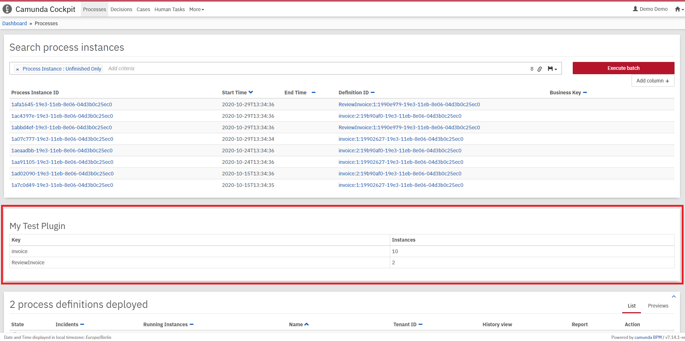

#set( $symbol_pound = '#' )
#set( $symbol_dollar = '$' )
#set( $symbol_escape = '\' )
${symbol_pound} ${eximeebpms-plugin-name}
${eximeebpms-plugin-description}

This project has been generated by the Maven archetype
[${archetype-artifactId}-${archetype-version}](https://docs.eximeebpms.org/manual/latest/user-guide/process-applications/maven-archetypes/).

${symbol_pound}${symbol_pound} Show me the important parts!

${symbol_pound}${symbol_pound} How to use it?
Build the plugin with `mvn clean install`.

Afterwards, you can install the plugin as described in [our guide](https://github.com/eximeebpms/eximeebpms-examples/tree/main/examples/cockpit/cockpit-fullstack-count-processes#integrate-into-eximeebpms-webapp).

Once you installed the plugin it should appear in
[EximeeBPMS Cockpit](https://docs.eximeebpms.org/manual/latest/webapps/cockpit/).

${symbol_pound}${symbol_pound} More information
[Cockpit plugins](https://docs.eximeebpms.org/manual/latest/webapps/cockpit/extend/plugins/)

[How to develop a Cockpit plugin](https://github.com/eximeebpms/eximeebpms-examples/tree/main/examples/cockpit/cockpit-fullstack-count-processes)

Discover more Cockpit plugins in the
[EximeeBPMS Cockpit examples](https://github.com/eximeebpms/eximeebpms-examples/tree/main/examples/cockpit)

${symbol_pound}${symbol_pound} Environment Restrictions
Built and tested against EximeeBPMS version ${eximeebpms-version}.

${symbol_pound}${symbol_pound} License
[Apache License, Version 2.0](http://www.apache.org/licenses/LICENSE-2.0).
