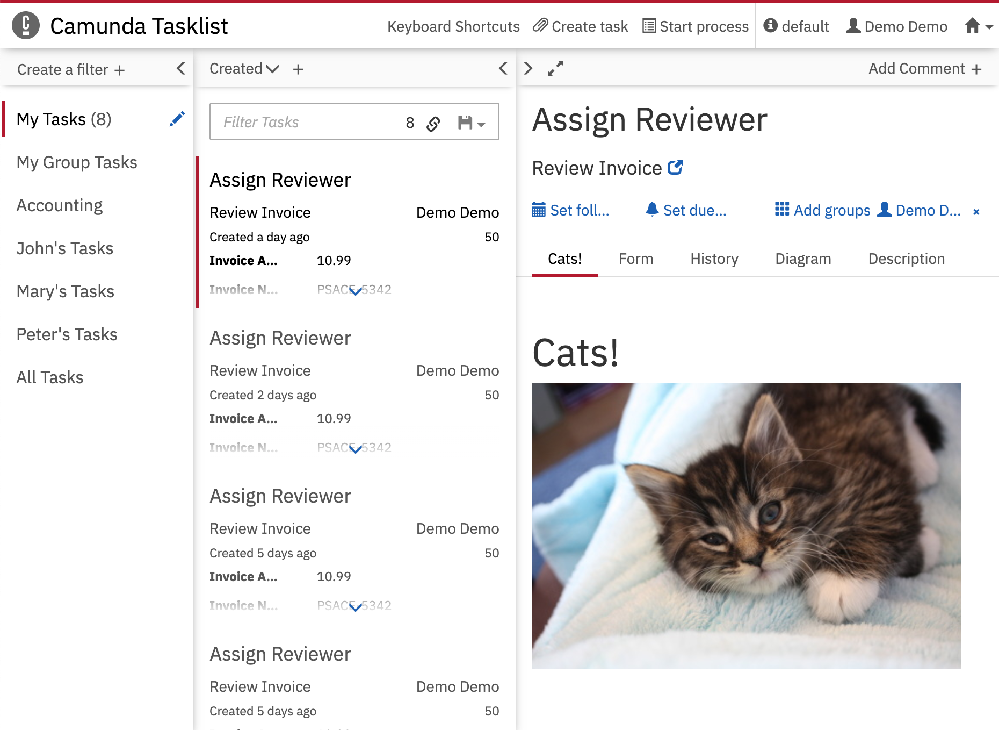

Javascript Only Plugin for EximeeBPMS Tasklist
=================================

This example shows how to develop a Tasklist plugin without the need to register it with the EximeeBPMS Platform server. It makes use of the `customScript` property of the webapp configurations.

Built and tested against EximeeBPMS version `7.24.0`.




Integrate into EximeeBPMS Webapp
-----------------------------

Copy the `cats.js` file into the `app/tasklist/scripts/` folder in your EximeeBPMS webapp distribution. For the Tomcat distribution, this would be `server/apache-tomcat-X.X.XX/webapps/eximeebpms/app/tasklist/scripts/`.

Add the following content to the `customScripts` object in the `app/tasklist/scripts/config.js` file:

```javascript
  // …
  customScripts: [
    'scripts/cats'
  ],
  // …
```

### Content security policy

By default, EximeeBPMS Platform uses a strict content security policy that doesn't allow images from external sources.
See our documentation about [Content Security Policy](https://docs.eximeebpms.org/manual/latest/webapps/shared-options/header-security/#content-security-policy) and [How to configure it](https://docs.eximeebpms.org/manual/latest/webapps/shared-options/header-security/#how-to-configure).

In order for this example to work, you need to either completely disable CSP via the `contentSecurityPolicyDisabled` property or update your `img-src` directive for instance to the following value:

```
img-src 'self' *.thecatapi.com thecatapi.com *.tumblr.com data:;
```

License
-------

Use under terms of the [Apache License, Version 2.0](http://www.apache.org/licenses/LICENSE-2.0)
